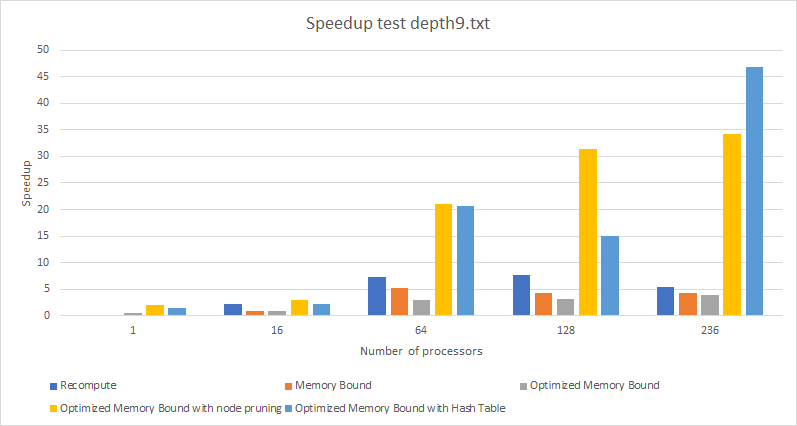

[Project Proposal](index.md) / [Project Checkpoint](project_checkpoint.md) / [Final Project Report](final_project_report.md) / [Tasks](tasks.md)

## FINAL PROJECT REPORT

You could view this file in [google docs.](https://docs.google.com/document/d/1tEADWOWImbJg2HTiHy40nMyiPE5mfftS0JkikwVjYD4/edit?usp=sharing)

### SUMMARY

Given an arbitrary scrambled Rubik’s cube, we implemented a program that determines and finds the sequence with the fewest number of moves required to solve it. We used the shared-address space model on the Xeon Phis inside the latedays cluster, implementing a lock free hash table for pattern databases and a iterative deepening version with OpenMP tasks. During the poster session we will be able to solve cubes up to depth 9 that someone else can arbitrarily scramble. Please note that it takes a few minutes to write create the input file (with the sticker colors, etc.). 

### BACKGROUND 
The Rubik’s cube is a physical puzzle that humans often find difficult to solve. There are various strategies humans use for solving a Rubik’s cube. For example, one way is to solve it layer by layer. However, in this problem we were not just interested in finding a sequence of moves that solves the Rubik’s cube; we were interested in finding the sequence with the fewest number of moves. If there are multiple such sequences, we find just one of them. 

The Rubik’s cube is a difficult puzzle because the decision tree for it rapidly increases in breadth. We defined a move to be one quarter turn in either clockwise or counterclockwise rotation, so after one turn the cube could be in any of 2*6 = 12 possible states. After, say, 20 turns, it could be in any of at most 1220 = states, some of which may be identical. It is known and has been proven that for this definition of a turn, the maximum number of moves required to solve a 3x3 cube is 26 moves. 

The goal of our project was to experiment with different approaches to reduce this search space as much as possible. One might think that because testing each individual sequence of moves in the decision tree is independent of all the others, it was an easy problem to parallelize. However, this was not enough to speed up the search. We instead designed a system to intelligently search the tree. We don’t want to move to exploring the children of a particular node unless we are quite confident that those children could represent sequences of moves that are potentially optimal. 

There are two main data structures that our algorithm manages. One is the set of nodes in the decision tree we are currently working on. Each of these elements is a cube_t struct that encodes the state of a cube and is previous moves history. The other data structure is a hash table that is implemented with separate chaining using a lock free linked list. We use this hash table to store the different cube states and prune repeated nodes in different branches. 

There are several operations that are performed on the cube_t struct that are essential to the program’s functionality. The core of the program is in modifying the state of a cube in place efficiently. We achieved this by packing the information in the data structure significantly. For instance, we mapped each of the eight corners of a Rubik’s cube to numbers 0 to 7, and we use four bits rather than eight or more to store data for it. (We don’t use the extra bit, because it would not be advantageous to make use of it) 

In the final version of our algorithm, the set of cube nodes is created dynamically and maintained in the form of OpenMP tasks. By using iterative deepening depth-first search, we effectively visit nodes in a similar manner as breadth-first without needing to create large contiguous blocks of memory to store all the nodes for each iteration. Iterative deepening depth-first search is essentially depth-first search that is limited by a maximum depth in a series of iterations. This maximum depth is incremented by one for each iteration. 

The shared hash table data structure is implemented as an array of pointers to linked list nodes. Each node stores a cube_t object and a pointer to the next node. Inside each bucket of the array, the linked list is implemented as a lock free data structure using the gcc built-in function compare and swap. The maximum size of the hash table is calculated at compile time and equals the maximum amount of nodes that could be stored until a specified depth. Cube states after this depth are not stored to increase performance, as discussed in the approach section.

The algorithm takes as input a file that lists the colors of the pieces of the cube corresponding to their positions. The first two lines of the input file indicate the perspective from which the rest of the labels should be interpreted. Specifically, the first line indicates the front face color and the next line indicates the top face color. The next four lines encode the four corners on the front face. Then the next four encode the four middle pieces on the front face. It continues. The entire human-readable input file format is in the file inputs/template.txt. The figure below also indicates how we encoded the state of the cube. 

Figure 1. Cube pieces definition.

We should mention that deciding on this format as the input was not easy, because the way the input was encoded dictated how we would efficiently perform operations on the cube in the actual program. For example, using this format allows a turn of the front face to require modification of only two of the data fields in the cube_t struct (besides those that encode move-related data). 

The output of the program is fairly simple, by contrast. We simply output whether we found a solution or not by the specified maximum depth (which is 26 by default) and then we write the sequence of moves required to solve the cube in human readable format to a file in the file_outputs/ directory. 

As mentioned above, searching the decision tree is computationally the most expensive operation. Furthermore, it is also memory-intensive. The tree grows exponentially, so there is high incentive to ‘prune’ a node so that we don’t have to do the work of its children in the next depth iteration. Without any pruning, searching this decision tree can be done entirely in parallel because each node can be examined independently for whether it is solved yet or not. However, when we make the program smarter by dynamically pruning nodes, it no longer becomes as independent and it becomes necessary to have synchronization between the threads. 

We managed to balanced the work distribution and require the less memory possible. The biggest dependency in our solution is the hash table that stores the cube states, also known as the pattern database. All the parallel thread could be adding data to the table where linked lists are present. The final version have a good amount of locality thanks to the work distribution and usage of the least amount of objects, but we discuss this in detail in the approach section. Most of the operations are amenable to SIMD execution, with the exception of the hash table operations, where most of the node access are different.

### APPROACH 

We used Assignment III with the shared-address space model as our starting point in designing our algorithm. We ended up creating a total of five different algorithms that solve the problem. Four of these are just benchmarks in an algorithm that evolved into our final algorithm ‘Optimized Memory Bound with Hash Table’. However, we also did try a breadth-first approach ‘Recompute’ that uses very little memory yet effectively does no pruning. 

We will first discuss our final algorithm ‘Optimized Memory Bound with Hash Table’. This program strives to use moderate amounts of memory to search the space while still optimizing the search by pruning nodes that either are wasteful or duplicated. We use two types of pruning: static pruning and dynamic pruning. 

First, the input file is read in and a single cube_t struct is populated with values. This cube_t struct is the only set of data that is allocated before being sent to the XEON PHI processors. Then, a single flag is used to keep track of whether the solution has been found by any processor or not. This flag is dynamically allocated and shared by all the threads. Each thread routinely checks to see if a solution has been found by a different thread. Hence we are using cache coherence to broadcast the message when a solution has been found. We think this is the fastest way to stop the search once it needs to be terminated. We are implementing an OpenMP critical section for updating the variable because it’s not likely that multiple nodes will find a solution at the same time, hence hitting the value in the cache.

OpenMP tasks are created as follows: Each thread (starting with the master thread) obtains a cube_t struct containing the cube state it is going to work on. It first creates another OpenMP task representing the previous cube state (take current state and revert it back by one move) except with a different move made to it (one of the remaining twelve possible other moves) that will likely be undertaken by another thread (or otherwise queued) and then continues with its work. It checks to see if the existing state is in the hash table already. If it is identical to a state in the hash table, and that state has fewer moves than this one, it finishes its work on this cube as no optimal solution could be found if we keep branching (another node is taking care of the state and achieves so in less moves). If the cube state is eligible to be added to the hash table, these are all the nodes below 5 moves, or it is more efficient than an existing entry, we add it to the table (and evict the entry if applicable). This is done using lock-free techniques with the cubeLinkedList_t struct. Rather than have a global lock on the hash table or even locks on each list within it, we designed the linked list addition so that we only need to do a single successful compare and swap to ensure successful addition of the element. If another element changed the state while the node was trying to add the value, it retries until completion.

Next, we prune the node using regular expressions. Each cube_t struct which comprises the work space contains the past sequence of moves that got it there. We analyze this sequence of moves to identify patterns in it that are wasteful or duplicated. A simple example of this is the pattern MMM which stands for making the same move M three times in a row. It is more efficient to make the opposite direction move once so this node would be pruned. A more complicated example are the expressions MNN*M or MNN*M’. The pattern M N N* M is when you make a move M, then make one or more moves N that are mutually exclusive (occur on the opposite side of M) and then make the same move M again. This is the same as making the first move twice in a row, and then doing the remaining moves in between. For this reason, we prune this node. Also, the expression M N N* M’ is wasteful because it makes a move, does a series of moves N on the opposite face, and then makes the same first move except in the opposite direction. If the node is pruned, the work stops. Otherwise, it continues.

Finally, the thread checks to see if the global solved flag was set. If it was set, no new work is created. Otherwise if the flag was not set, but this thread found a solution, then the thread atomically updates the original cube_t struct that was passed in and sets the flag. Otherwise, it increments the depth of the cube it is currently searching by making another move on it. It is important to note that this is done after the pruning and hash table check, so this means that the search only progresses down a level on nodes that have not been removed from the search. This is repeated until the current depth limit is achieved. If no solution is found within that limit, we increase the overall limit by one and keep searching. If we reach depth 26 and still no solutions is found, this has been proved to be a cube without solution given the definition of our moves space.

When making the first version of iterative deepening depth-first search, we ended with a memory bound solution that required more than 16 GB in memory to reach a goal node in depth 8. This was because it used the standard library for the stack struct, creating a node within a task for all the possible moves on each node. After that, we decided to create only the next task node (described in the previous paragraph) and keep processing the first move from that particular state until a solution is found, the node is pruned or we reach the depth limit. This helped the algorithm in two important ways. The first one, it changed the algorithm space to become linear and it is calculated as max nodes size = (Nodes in queue + nodes being processed) * size of cube =  [(max depth)(num procs) + 1] * size of cube = [26*236 + 1] * 36B = 215.75 KB.

The second benefit is we reduced the amount of work per processor on early phases of the search. Instead of only processing one node at the time and spawning more work, each processor continues branching a couple of nodes before requesting another task from the queue.

We used C++ for this program because it is efficient and runs on the XEON PHI processors. We targeted a shared-address space model because this allows rapid access to the hash table which is shared by all the processors. It also makes cleaning up the program when a solution is found easier.

In our final implementation, the operations we discussed map to machine concepts as follows. As described earlier, each thread sequentially does the work described above on one processor. The granularity of the work is therefore usually n cubes per thread at a time, where n is the number of cubes the thread is able to evaluate before any of them are found in the hash table, pruned, or if a solution is found. In the Xeon Phi, up to four threads can be run on a single core so with as much as 236 threads enabled, the work is assigned as four simultaneous sets of workloads running on each core. 

We also tried a memory-conscious breadth-first algorithm ‘Recompute’ to provide insight to its performance. It works as follows. Each thread has its own dynamically allocated array of cube_t structs, the ith of which holds the state of the cube in the ith move. For example, the 0th cube holds the original state; the 1st cube holds one move made on that state, etc. Then, we represent the tree as a base 12 number, since there are twelve possible moves that can be made at each possible step. If we start at 0 and increment the number by one (in base 12) up to 12depth, every number will represent a different move sequence at most depth long. So one way to partition the work for breadth first without needing to allocate more memory than is absolutely necessary is to give each thread a partition of the integers in the set from 0 to 12depth. Then, once a thread receives its work, it recomputes the past moves (there are depth of them and they are encoded in the number) and then checks if the cube is solved or not. We tried this method because we implemented the cube state to be efficient to manipulate and doing so is mostly arithmetic. Doing this is not ultimately faster than the final algorithm described above. However, it is efficient for small depths because of its low memory usage. 

We also tried a naive breadth first search algorithm that allocated huge contiguous blocks of memory that would then be filled in by each individual thread to represent the entire working set for a particular depth. However, this approach did not work because allocating contiguous blocks of memory that are too large causes the kernel to kill the program. This is why we chose iterative deepening depth-first search. 

Our original serial algorithm was very naive and was simply breadth first search that allocated contiguous blocks of memory for storing the nodes. Then we switched it to be an implementation of iterative deepening depth-first search. For this implementation, we are using the stack standard library because it is serial and we do not experiment a huge demand on memory consumption. A hash table optimized for serial code was implemented, it is very similar to the concurrent approach but improving locality and without atomic operations. The static pruning was also implemented in this algorithm for being able to compare with the latest version of the parallel code.

### RESULTS

We achieved the goals specified in our ‘PLAN TO ACHIEVE’ section of our proposal. We had set an arbitrary goal of obtaining at least 20x speedup. We have achieved this, for instance on depth9 input, 236 threads has 46.9274197x speedup. We measured performance in terms of computation time. This was time taken to run the algorithm on the PHIs and does not include parsing files or writing output data. This time does including sending data to the PHIs but since we don’t send that much data to begin with this mainly measures computation time. 

We will first discuss the performance of our algorithm versions on four inputs: depth 1, depth 5, depth 8, and depth 9. Here, depth indicates the optimal number of moves required to solve the input cube state. The sizes of these inputs is the same, since they are encoded the same way. The final version of our algorithm is the column on the right ‘Optimized Memory bound with Hash Table’. 

Graph 1. Performance (Computation Time) By Algorithm For Depth 1 Input (times in seconds).

On a depth 1 input (graph 1), all the algorithms take up to 0.50 seconds to compute the solution which involves only up to 12 checks. This is why the numbers are generally low and this is mainly a reference to show how the algorithms compare in terms of setup time. The only important thing to observe here is that a larger thread count requires more time due to more overhead in launching the threads. 

Graph 2. Performance (Computation Time) By Algorithm For Depth 5 Input (times in seconds).

Depth 5 (graph 2) is an interesting case study. At depth 5, there is still a small number of nodes that are being evaluated and so the computation times are comparable, with no significant differences except for the Hash Table implementation (For instance, for 16 threads all other implementations finish in at most 0.4 seconds while the hash table implementation takes 0.7 seconds). We see that this implementation takes more time than the others due to the overhead of populating the hash table in the first place. The results in the hash table will be most useful after depth 5 since that is when the hash table becomes read-only and there won’t be any writes. In fact, the one-thread case actually performs better than the others due to the spawn of more processors. In such fast search, it is better to do not spend time with the parallel overhead of more processors than actually doing computation.

Table 1.Performance (Computation Time) By Algorithm For Depth 8 Input (times in seconds).

Graph 3. Performance (Computation Time) By Algorithm For Depth 8 Input (times in seconds).

At depth 8 (graph 3), we start to see more interesting results that closely match our predictions. We see firstly that our final implementation is the one of the fastest overall algorithms with 2.070275 second computation time with 236 threads, as read on table 1. However, it is not the fastest. The reason why it is much faster than the algorithms without the hash table is because the hash table is pruning more nodes after depth 5 that would otherwise be naively computed. We also see here that the benefits of pruning are now apparent. Pruning has a computational overhead that occurs when you check to see if a pattern is present in a particular sequence of moves. The pruning implementations (right two columns) perform better than the two columns to the left. For example, with 128 threads, the optimized memory bound implementation takes 2.607953 seconds while the version with pruning added takes just 1.20087 seconds. This is also visible at low thread counts. For instance, with just one thread, the version without pruning takes 311.01571 second while the version with pruning takes just 131.24874 seconds. Another observation we see here is that at this depth the overhead to initiating and managing multiple threads is now quantitatively worth it. All parallel algorithms show decreased computation time up to 128 threads. This indicates that at this depth, the algorithms are taking advantage of the parallelism available to them. Lastly, we also notice here that the Recompute algorithm (breadth-first search, discussed earlier) is taking more time. Although its memory usage is extremely small, because it has to recompute every single node in the tree, its computation time is starting to suffer. For example, with 128 threads it takes 5.32 seconds whereas the iterative deepening depth-first search versions take at most 2.6 seconds. 

Table 2. Performance (Computation Time) By Algorithm For Depth 9 Input (times in seconds).

Graph 4. Performance (Computation Time) By Algorithm For Depth 9 Input (times in seconds).

At depth 9 (graph 4), we see similar results to those we saw in depth 8. However, now the hash set implementation is the fastest taking 17.995035 seconds to run with 236 threads, are read on table 2. This indicates that the hash table is actually worth its overhead. After depth 5 it becomes read-only and because each processor will have shared copies of it without any invalidation occuring, it becomes advantageous for the algorithm. Another observation here is that the recompute algorithm is starting to suffer from performance degradation at high thread counts. At 236 threads, it takes 154 seconds to run whereas at 128 threads it takes only 109 seconds to run. When 236 threads are run in parallel on the Xeon Phi, each individual thread suffers performance. Also, there is an implicit barrier at the end of each iteration of the search, so there is a little waste of time waiting for all the tasks, killing the existing threads and spawning them again for the next iteration. This could be improved in a future version of the algorithm.

Graph 5. Performance (Speedup) By Algorithm For Depth 9 Input (times in seconds).

The speedup plot (graph 5) shows us which algorithm took advantage of parallelism the most. We analyze from this that the hash table implementation was able to obtain the highest speedup of 46.9274197x (when run with 236 threads). On the other hand, the optimized memory bound version had the lowest speedup of 3.855x. One important observation here is that pruning the nodes has a significant impact on the speedup because it reduces the search space significantly. Quantitatively more nodes can be pruned for larger depths because once a node is pruned, its children won’t be explored, either. Another observation is that the Recompute version had a moderate, but not high maximum speedup of 7.72x despite it being an almost entirely parallel algorithm with little communication between the threads. This indicates that memory storage and management of cube states becomes more advantageous as depth increases, whereas recomputing each node has a peak performance and then drops off. 

One factor that limits the speedup of our algorithm (final implementation) is false sharing within each thread. If we increase the number of cubes handled in a single task placing them one after another so that they fit on a precise number of cache lines, then we will be able to take advantage of the prefetching benefit of accessing contiguous elements. The sizeof(cube_t) is 36 bytes, so even two of them stored next to each other will spill over a cache line and create false sharing in the Xeon Phis which cache line size is of 64 bytes. 

Graph 6. Performance (Computation time) by Optimized Memory Bound with Hash Table Algorithm (times in seconds) for different hash table sizes.

Another important graph is the plot of hash table size versus computation time (graph 6). All of these use the hash table implementation on input depth 9. However, here we see the costs to storing more or less information in the hash table. If the hash table is too small (stores up to depth 4), then the algorithm takes longer because fewer nodes can be pruned. For instance, running this implementation with 236 threads still takes 22.34 seconds. If the hash table size is increased too much, then although it will have more information, searching through the information and manipulating it takes more time. If the table stores up to depth 7 nodes, it then takes as much 106 seconds to finish even on 236 threads. Storing up to depth 5 nodes is optimal at 17.99 seconds and that is why we chose it. This becomes simpler to understand analyzing the next graphs.

Graph 7. Cache misses by Optimized Memory Bound Algorithm for different hash table sizes.

When we examine the number of cache misses versus the hash table size, we see a constant correlation. The cache miss count of 216,887 for a large table storing up to depth 7 is comparable to the cache miss count of 205,400 for a large table storing up to depth 4. These were all done on the same depth9 input. We suspect that there are two forces affecting this behavior. On one hand, a larger hash table stores more data and thus will result in more nodes being pruned. This decreases the cache miss rate because there are fewer children being examined. However, the cache miss rate increases because initially in creating the table, there will be more cache misses because more memory is allocated and written into. But overall, the cache miss rate remains constant because as we store more nodes in the hash table we are also increasing the hash table size, which reduces the amount of time spent traversing across buckets.

Graph 8. Free hash table memory of depth 5 iteration time (in seconds) by Optimized Memory Bound Algorithm for different hash table sizes.

That leaves us with a different main reason of the deprecated performance while increasing the hash table size. As we are able to see in the graph ‘Free hash table memory’, as we increase the hash table size it takes longer to delete the hash table memory within each iteration of iterative deepening. That is why most of the time is spent clearing the memory before starting again. Therefore, we found out that depth 5 stores 248,833 nodes, which equal a hash table memory of 11.39 MB.

With the graphs that we analyzed and the things described in the write-up, we found interesting numeric results that validates our results. For the depth9.txt test, we only have 150 atomic operations that failed and required to try again of the 264,293 entries added to the table (taking into account multiple iterations). 72,794 nodes were added added into the same bucket that another cube state. 6,257,513 nodes searches were pruned thanks to the hash table database. 73,749 nodes could not prune the search because they were added before to the hash table than the optimal state. This last number leaves room of improvement but we believed that the node search will be pruned in a future reference to the hash table anyway.

We used gprof to profile our program execution and examine how much time is spent in the different parts.

Table 3. Gprof analysis of time executed per function.

We are not sure why frame_dummy has a high proportion of time. We did some research, it seems to be a routine that OpenMP performs. 

The first observation is that the time is broken down evenly and no single function or subroutine is taking more than 33% of the time. Unsurprisingly, make_move is the most time intensive function. It is essential to the program because it is what modifies a cube state in place. We also notice that searching and modifying the hash table is the next significant (13.37 %) time intensive activity. Cube_step is also an essential function for doing and creating the parallel work in the first place. The other functions (contains_regex, left, solved, and get_cube_hash) are primarily arithmetic-intensive subroutines that don’t access much memory. However, they are frequently-called helper functions so their usage makes sense. 

There is room to improve in reducing the time spent searching the hash table. The overall time can be improved by reducing computation, perhaps by adding smarter pruning techniques. Another thing that could be added is a different pattern database that stores the minimum and maximum moves from the cube state to reach the goal. This heuristic with the conjunction of iterative deepening A* algorithm, could improve the results.

We believe that our choice of machine aligned with the nature of the problem. Quantitatively we can see that intelligently searching the search space is more efficient than brute force search, even in parallel. A GPU would not have been appropriate for this problem because we would have a much harder time maintaining a central hash table that all threads can access. We think that the shared-address space model is better for this problem than the message-passing model because our algorithm relies heavily on making sure threads have the most up-to-date information in real time while the amount of conflicts between the data is very small. Message passing would require the hash table to be sent between processes periodically to keep them all up-to-date. 

### REFERENCES
Korf, Richard. (1997). Finding Optimal Solutions to Rubik’s Cube Using Pattern Databases. American Association for Artificial Intelligence. Los Angeles, CA. 

Nargolkar, Aslesha. “Solving The Rubik’s Cube With Parallel Processing.” The University of Texas at Arlington, 2006.

### LIST OF WORK BY EACH STUDENT, AND DISTRIBUTION OF TOTAL CREDIT. 

We both did substantial work on this problem. We would like 50% - 50% credit distribution. 

Nihar did much of the initial experimentation in modifying the assignment III code to work with Rubik’s cube solver. He decided and implemented on the input/output scheme. He also developed the cube_t struct that packs the data as much as possible to reduce memory consumption and he wrote many functions that de-compressed and compressed this data to make the remaining programming easier. Nihar also modified Diego’s parallel implementation to work with static pruning. 

Diego wrote the initial naive parallel and serial implementation using iterative deepening algorithm and OpenMp tasks, making the program memory bound. After Nihar implemented static pruning, Diego focused on reducing drastically the memory consumption of the algorithm. Afterwards, implemented a hash table with lock-free linked list chain inside each bucket to prune duplicated states.

Both Diego and Nihar helped look over each others’ code and debugged it throughout the course of the project. Both Diego and Nihar worked on substantial components of the writeup. 
